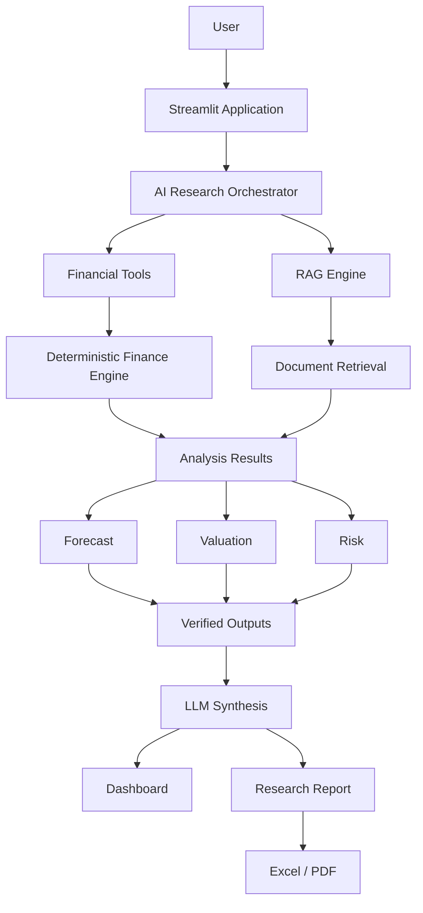

# FinModel AI

**AI-Powered Equity Research & Valuation Platform**

FinModel AI lets you enter a public-company ticker and produce institutional-style
equity research: normalised financial data, a linked three-statement model,
multiple valuation methodologies (DCF, comparables, precedent transactions,
reverse DCF), risk and sensitivity analysis, Monte Carlo simulation, filing-grounded
Q&A, and an AI research analyst that orchestrates all of the above — then export the
result to Excel and PDF.

The guiding architectural principle: **a deterministic Python engine performs every
calculation; the LLM orchestrates, explains, and narrates, but never does the
arithmetic.**

---

## Project status

The platform was built in fifteen disciplined phases — all now complete. Every phase
ended with a green test run, and the project is runnable end-to-end (`python app.py` for
the smoke test, `streamlit run app.py` for the dashboard).

| Phase | Area | Status |
|------:|------|:------:|
| 1 | Scaffolding, configuration, Pydantic models, test harness | ✅ Complete |
| 2 | Data providers (yfinance + local sample) + normalisation | ✅ Complete |
| 3 | Deterministic ratio/analysis engine | ✅ Complete |
| 4 | Linked three-statement model (income + balance + cash flow) | ✅ Complete |
| 5 | Driver forecasting + bull/base/bear scenarios | ✅ Complete |
| 6 | DCF + WACC | ✅ Complete |
| 7 | Comparables + precedent transactions | ✅ Complete |
| 8 | Reverse DCF + sensitivity | ✅ Complete |
| 9 | Monte Carlo | ✅ Complete |
| 10 | Document RAG (PyMuPDF + FAISS) | ✅ Complete |
| 11 | OpenAI tool-calling research agent | ✅ Complete |
| 12 | Streamlit + Plotly UI | ✅ Complete |
| 13 | Excel + PDF reporting | ✅ Complete |
| 14 | Full test suite + agent evaluation set | ✅ Complete |
| 15 | Docker + CI + docs | ✅ Complete |

**Phase 1 delivers the typed foundation everything else is built on**: the complete
internal data model layer (statements, valuation inputs/outputs, RAG, agent
envelopes), centralised configuration, shared utilities, and a 120+ test suite. No
placeholder numbers, no fabricated data.

**Phase 2 adds the data layer**: a common `DataProvider` interface with a live
`YFinanceProvider` (which normalises Yahoo Finance's `.info` dicts and statement
frames into the typed models) and a `LocalSampleProvider` backed by bundled sample
datasets, plus a validation layer that checks accounting identities and data
completeness, and an ingestion orchestrator that falls back to sample data when live
retrieval is unavailable. The platform now loads a company end-to-end offline.

**Phase 3 adds the ratio engine**: a deterministic calculator that turns the
statements into a chronological `RatioAnalysis` — profitability and margins, ROE and
ROIC, liquidity, leverage, and working-capital day metrics (DSO/DIO/DPO and the cash
conversion cycle) — all computed in plain Python and `None`-safe when inputs are
missing. On the bundled Apple data it reproduces the real profile (expanding gross
margins, ~170% ROE, a negative cash conversion cycle).

**Phase 4 adds the linked three-statement model**: from a company's history and a set
of per-year operating drivers, it projects a fully-linked income statement, balance
sheet, and cash flow statement, with a CapEx/PP&E roll-forward, a debt schedule, and
DSO/DIO/DPO-driven working capital. Cash is the cash-flow plug and equity rolls by
retained earnings, so **every projected balance sheet balances to the penny** — the
engine verifies this on each year. It also emits the unlevered free-cash-flow path the
DCF will consume, and can derive a base-case driver set from the historical statements.

**Phase 5 adds scenarios**: it flexes the base drivers into optimistic (bull) and
pessimistic (bear) cases — higher growth and better margins for the bull, the reverse
for the bear, all clamped to valid ranges — runs the three-statement engine under each,
and collects the revenue/EBITDA/EBIT/net-income/FCFF trajectories into a
`ScenarioComparison`. On the Apple base case, a ±3pt growth and ±2pt margin flex spreads
terminal-year revenue from roughly $444B (bear) to $590B (bull).

**Phase 6 adds DCF and WACC** — the first valuation output. A WACC engine computes the
cost of equity (CAPM), the after-tax cost of debt, and market-value-weighted WACC; a
DCF engine discounts the forecast's unlevered FCFF path, adds a Gordon-growth terminal
value, and bridges enterprise value → equity value → implied share price (reporting the
share of value in the terminal). An end-to-end `dcf_valuation()` wires forecast → WACC →
discount straight from a ticker, so loading a company now yields a per-share value that
moves transparently with its assumptions.

**Phase 7 adds the market-based methods**: a trading-comparables engine computes peer
multiples (EV/Revenue, EV/EBITDA, P/E, P/B), summarises them (mean/median/quartiles),
and applies the chosen statistic to the target's own metrics — bridging EV multiples to
equity via net debt — and a precedent-transactions engine does the same over M&A deal
multiples. A small labelled peer set ships with the sample data, and precedent deals are
clearly-flagged illustrative samples (the platform never fabricates real deal figures).

**Phase 8 completes the valuation methods and adds the analysis layer.** A reverse DCF
takes today's price and solves (by bisection) for the revenue-growth or terminal-growth
assumption the market is implying — on the Apple sample, the ~$177 price implies roughly
23%/yr revenue growth, far above the 6% base case. A sensitivity module builds a
WACC x terminal-growth grid of implied prices and a tornado-style driver ranking, so it's
immediately clear how much each assumption moves the valuation (WACC is the largest
driver for Apple).

**Phase 9 adds Monte Carlo simulation.** It samples the key assumptions (revenue
growth, terminal growth, WACC, FCF margin) from normal/triangular/uniform/lognormal
distributions — seeded for reproducibility — and prices *every* draw through a
vectorised DCF, summarising the resulting distribution into P10-P90, mean/std, and the
probability of upside versus the current price. Randomness enters only through the
assumptions; the engine never samples prices directly. On the Apple sample, 10,000 draws
give a roughly $68-$115 P10-P90 range and correctly assign a very low probability of
upside against the ~$177 market price under conservative base assumptions.

**Phase 10 adds the document RAG layer.** Filings are extracted (PyMuPDF for PDFs, with
a plain-text path), split into section-aware overlapping chunks that preserve page and
Item-heading provenance, embedded, and indexed; a query retrieves the most relevant
passages and an answer is synthesised with inline citations to the exact source. The
production path uses OpenAI embeddings and FAISS, but the whole pipeline also runs fully
offline via a deterministic local embedder and a NumPy index — so retrieval is genuinely
tested, not stubbed. Citations always point at real retrieved passages; the engine never
invents a source.

**Phase 11 adds the research agent** — the capstone that ties the engines together. It
exposes 11 typed tools (get_company_data, calculate_ratios, forecast_financials,
run_scenarios, calculate_dcf, calculate_comps, calculate_precedent, reverse_dcf,
run_sensitivity, run_monte_carlo, retrieve_filing_evidence), each backed by the
deterministic Phase 2-10 engines, and drives an LLM through a tool-calling loop that
selects tools, feeds their results back, and writes a sourced summary. Every number
comes from the engines — the LLM only orchestrates and narrates. The production path
uses OpenAI function-calling; an offline rule-based planner drives the identical loop so
tool dispatch, argument handling, and response assembly are genuinely tested. The
returned `AgentResponse` is a full audit trail of which tool produced which figure.

**Phase 12 adds the interactive dashboard.** A Streamlit app (``streamlit run app.py``)
with an assumptions sidebar and five tabs — Overview, Financials, Valuation, Scenarios &
Sensitivity, and a Research Assistant chat wired to the agent — renders the analysis via
Plotly (revenue bars, margin trends, a valuation football field, scenario paths, a
sensitivity heatmap, a Monte Carlo distribution, and a driver tornado). The
framework-agnostic pieces (formatting, the analysis orchestrator, and the chart builders)
have no Streamlit dependency and are unit-tested directly; the Streamlit glue is
compilation-verified.

**Phase 13 adds report export.** The same analysis bundle can be written to a formatted
multi-sheet Excel workbook (openpyxl: summary, assumptions, ratio history,
three-statement forecast, valuation detail, and Monte Carlo distribution) and to a PDF
research report (reportlab: executive summary, key metrics, valuation summary, ratios,
and assumptions). Both run in the dashboard behind download buttons, and the tests
generate real files and assert on their contents.

**Phase 14 adds the agent-evaluation suite.** A declarative harness runs 55 cases across
thirteen categories (overview, ratios, each valuation method, forecasting, scenarios,
sensitivity, Monte Carlo, filing evidence, comprehensive, and mixed/edge queries),
asserting that the agent selects the right tools, that every tool call succeeds, and that
the answer contains the expected findings. It runs deterministically against the offline
agent (``python -m evals`` or via pytest) at a 100% pass rate, and the same cases validate
the OpenAI agent when configured.

**Phase 15 adds production packaging.** A ``Dockerfile`` and ``docker-compose.yml`` run
the dashboard in a container; a GitHub Actions workflow lints (ruff), imports/runs the
project, and executes both the test and evaluation suites on Python 3.11 and 3.12; a
``Makefile`` wraps the common tasks; and ``CONTRIBUTING.md`` documents the architecture
and conventions. The codebase is ruff-clean.

---

## Problem statement

Equity valuation is spreadsheet-bound, error-prone, and hard to audit. LLMs are
fluent but unreliable at arithmetic and prone to inventing figures and citations —
disqualifying them from doing financial math directly. FinModel AI resolves the
tension by splitting responsibilities:

- **Deterministic engine** — Pydantic-typed, fully tested Python computes ratios,
  builds the three-statement model, and runs every valuation. Results are
  reproducible and verifiable.
- **LLM layer** — interprets intent, selects tools, supplies structured parameters,
  receives *verified* numbers, and turns them into explanations and research
  narratives. It cannot fabricate a valuation because it never computes one.

## Architecture



Data flows one way: raw provider data is **normalised into internal Pydantic
schemas**, computed on by the deterministic engine, verified, and only then handed to
the LLM for synthesis.

## Features

- Ticker-driven ingestion (AAPL, MSFT, NVDA, AMZN, GOOGL, …) with graceful fallback
  to bundled sample data when live retrieval fails.
- Linked three-statement model with driver-based 5-year forecasts and accounting
  identity checks (A = L + E, debt roll-forward, FCF consistency).
- Four valuation methodologies: **DCF/WACC**, **trading comparables**, **precedent
  transactions**, **reverse DCF**.
- Two-dimensional sensitivity grids (WACC × terminal growth) and tornado-style driver
  rankings.
- **10,000+ path Monte Carlo** that propagates sampled assumptions through the real
  DCF engine for P10–P90 ranges and upside/downside probabilities.
- **Document RAG** over 10-K/20-F/earnings PDFs with page-level source citations.
- **AI research agent** using OpenAI tool-calling over 8+ typed tools, exposing which
  tools produced which numbers.
- Excel model and PDF research report generated from actual model outputs.

## Technology stack

| Layer | Tools |
|------|------|
| Core | Python 3.11+, Pandas, NumPy, Pydantic v2, pydantic-settings |
| Quantitative | SciPy, yfinance |
| AI | OpenAI API (tool-calling + embeddings) |
| RAG | FAISS, PyMuPDF |
| App / viz | Streamlit, Plotly |
| Reporting | OpenPyXL, ReportLab |
| Testing / eng | Pytest, Git, Docker, GitHub Actions |

## Installation

```bash
git clone <your-repo-url> finmodel-ai
cd finmodel-ai
python -m venv .venv && source .venv/bin/activate   # Windows: .venv\Scripts\activate
pip install -r requirements.txt
```

> Phase 1 only requires `pydantic`, `pydantic-settings`, and `pytest` to run and test
> the current foundation. The full `requirements.txt` provisions the whole stack for
> later phases.

## Environment setup

```bash
cp .env.example .env
# edit .env — set OPENAI_API_KEY only if you want the agent / document Q&A
```

All configuration is read from environment variables (or `.env`) via
`config.get_settings()`. **Secrets are never committed**; `.env` is git-ignored.

## Running locally

```bash
# Verify the foundation imports, configures, and models validate:
python app.py

# Run the test suite:
pytest

# Launch the interactive dashboard:
streamlit run app.py
```

## Running with Docker

```bash
docker compose up --build      # then open http://localhost:8501
```

Set ``OPENAI_API_KEY`` in your environment (or ``.env``) to enable the LLM-powered agent;
without it, the offline rule-based agent is used.

## Example workflow

Once the agent (Phase 11) and UI (Phase 12) are in place:

> **User:** "Analyze NVIDIA and tell me whether the valuation is sensitive to WACC."
>
> **Agent:** retrieves company data → computes ratios → builds forecast → runs DCF →
> runs a WACC × terminal-growth sensitivity → retrieves relevant 10-K evidence →
> synthesises a conclusion, showing every tool it called and every number's source.

## Financial methodology

- **DCF** — discounts explicit-horizon FCFF at WACC; Gordon-growth terminal value.
  The model enforces `WACC > terminal growth` so the terminal value cannot diverge.
- **WACC** — cost of equity via CAPM (risk-free + β·ERP); after-tax cost of debt;
  market-value capital-structure weights.
- **Comparables / precedents** — peer multiples (EV/Revenue, EV/EBITDA, P/E, P/B) with
  mean/median/quartile statistics applied to the target's metrics.
- **Reverse DCF** — numerically solves for the growth (or terminal) assumption implied
  by today's market price.
- **Monte Carlo** — samples assumption distributions and runs each set through the
  actual DCF, never generating random prices directly.

## Agent architecture

The research agent (Phase 11) is an OpenAI tool-calling loop over typed tools —
`get_company_data`, `calculate_ratios`, `forecast_financials`, `calculate_dcf`,
`calculate_comps`, `calculate_reverse_dcf`, `run_sensitivity`, `run_monte_carlo`,
`analyze_risk`, `retrieve_filing_evidence`. Tool arguments and results are validated
against Pydantic schemas (`core.models.agent`), so numbers always originate from
deterministic code.

## RAG architecture

`PDF → PyMuPDF text extraction → section-aware chunking → OpenAI embeddings → FAISS
index → semantic retrieval → source-grounded context`. Each chunk keeps its document
name, page number, and section (`core.models.rag.DocumentChunk`) so answers cite real
sources and never invent citations.

## Testing

```bash
pytest            # run everything
pytest -v         # verbose
pytest tests/test_models_valuation.py   # a single module
python -m evals   # run the 55-case agent-evaluation suite
```

Phase 1 shipped the typed foundation and Phase 2 the data layer, for **384 tests** (including the 55-case agent-evaluation suite)
covering value objects, statement derivations and accounting identities,
forecasting/scenario logic, all valuation input invariants (including the WACC > g
guard), risk/RAG/agent models, configuration, the yfinance normaliser (exercised
against realistic pandas frames), the sample provider and unit scaling, data-quality
validation, the ingestion fallback path, and import-level smoke tests. The suite grows
with each phase toward the 100+ meaningful tests plus a 50-case agent-evaluation set
specified for the finished platform.

## Project structure

```
finmodel-ai/
├── app.py                     # entry point / smoke test (Streamlit UI from Phase 12)
├── config/                    # centralised settings (pydantic-settings)
├── core/
│   ├── data/                  # ✅ providers, normalisation, validation, ingestion (Phase 2)
│   ├── models/                # ✅ Pydantic data models (Phase 1)
│   ├── analysis/              # ✅ ratio engine (Phase 3)
│   ├── forecasting/           # ✅ three-statement model + scenarios (Phase 4-5)
│   ├── valuation/             # ✅ DCF+WACC, comps, precedents, reverse DCF, sensitivity, Monte Carlo (6-9)
│   ├── risk/                  # risk indicators (Phase 16)
│   ├── agents/                # ✅ OpenAI tool-calling agent, 11 tools (Phase 11)
│   ├── rag/                   # ✅ document RAG pipeline (Phase 10)
│   ├── outputs/               # ✅ Excel / PDF report generation (Phase 13)
│   └── utils/                 # ✅ math + logging helpers (Phase 1)
├── ui/                        # ✅ Streamlit dashboard + Plotly charts (Phase 12)
├── tests/                     # ✅ test suite (Phase 1+)
├── evals/                     # ✅ agent-evaluation suite, 55 cases (Phase 14)
├── data/sample/               # bundled sample datasets (Phase 2)
└── .github/workflows/         # ✅ GitHub Actions CI (Phase 15)
```

## Limitations

- Live market data depends on yfinance and may be delayed, incomplete, or rate-limited;
  the platform falls back to clearly-labelled sample data.
- Valuations are only as good as their assumptions — outputs are analytical tools, not
  investment advice.
- The agent and document Q&A require an OpenAI API key and incur API costs.
- Sample precedent-transaction data is illustrative and explicitly flagged as such;
  no real transaction figures are fabricated.

## Future roadmap

- Additional data providers behind the provider interface (e.g. Alpha Vantage, SEC EDGAR).
- Segment- and geography-level modelling where filings permit.
- Caching layer for provider responses and embeddings.
- Configurable multi-model support and prompt/version tracking for the agent.
- Scenario persistence and shareable research artefacts.

---

*FinModel AI is an independently designed and implemented project inspired by the
workflow of modern AI-financial systems. It is for research and educational purposes
and does not constitute investment advice.*
